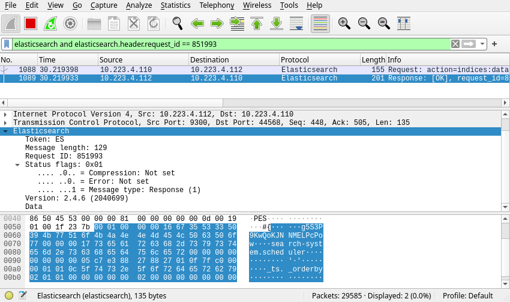

From time to time you need to analyse packets on a particular server. Usually people start by capturing packets with `tcpdump` and then use `wireshark` for the analysis.

The other day I had to debug ElasticSearch communications between nodes in a cluster. Capturing the traffic to a file, copying the file to my machine and opening the file in `wireshark` is a boring repetative task. So I googled if I could somehow capture it straight to `wireshark` running on my local machine.

The answer is, of course you can :smile:

You can even do it with a handy one-liner:

> **NOTE:** This command assumes that you have the rights to escalate your privileges to `root` on the server.

> **NOTE:** In my case I need to run `wireshark` as `root`, so I run it with `sudo`. This might not be the case for you.

```console
$ ssh my-server "sudo tcpdump -s 0 -U -w - -i ens3 port 9300" | sudo wireshark -k -i -
```

Now these are a lot of command flags, so lets try to break them down:

- `tcpdump`
  - `-s 0` : Set the snapshot length to `0`, that basically sets it to the default of `262144`. Im not sure what it should be in this case, but the capture seemed to work fine with it set like this.
  - `-U -w -` : Write each packet to `stdout` as soon as its captured rather than to write only when the output buffer fills up.
  - `-i ens3` : Listen to interface `ens3`. This will be different for you, and `-i any` can be used to listen on all interfaces.
  - `port 9300` : Only capture packets on port `9300`.
- `wireshark`
  - `-k` : Start capturing immediately.
  - `-i -` : Capture packets comming on `stdin`.

This wonderful command made the debug session a lot simpler. And of course `wireshark` understands the ElasticSearch protocol so you can easily see what is going on.

