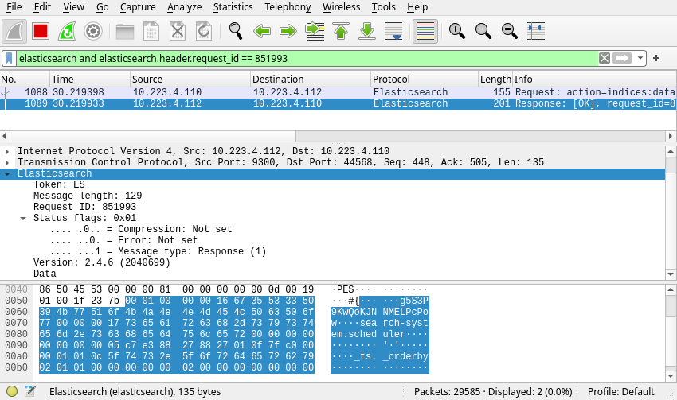

+++
author = "Guðmundur Björn Birkisson"
title = "Remote Wireshark Packet Capture"
date = "2022-05-02"
description = "Remotely analyse packets with Wireshark"
tags = [
    "debug",
    "shell",
    "ssh",
    "tcpdump",
    "wireshark",
]
+++

From time to time you need to analyse packets going to/from a particular server. Usually people start by capturing packets with `tcpdump` and then use `wireshark` for the analysis.

The other day I had to debug ElasticSearch communications between nodes in a cluster. Capturing the traffic to a file, copying the file to my machine and opening the file in `wireshark` is a boring repetative task. So I googled if I could somehow capture it straight to `wireshark` running on my local machine.

The answer is, of course you can :smile:

You can even do it with a handy one-liner:

> This command assumes that you have the rights to escalate your privileges to `root` on the server.

```console
$ ssh my-server "sudo tcpdump -s 0 -U -w - -i ens3 port 9300" | sudo wireshark -k -i -
```

Now these are a lot of command flags, so lets try to break them down:

- `tcpdump`
  - `-s 0`: Set the snapshot length to `0`, that basically sets it to the default of `262144`. I am not smart enough to know what it should be in this case, but the capture seemed to work fine.
  - `-U -w -`: Write each packet to `stdout` as soon as its captured rather than to write only when the output buffer fills up.
  - `-i ens3`: Listen to interface `ens3`. This will be different for you, and `-i any` can be used to listen on all interfaces.
  - `port 9300`: Only capture packets on port `9300`.
- `wireshark`
  - `-k`: Start capturing immediately.
  - `-i -`: Capture packets comming on `stdin`.

This wonderful command made the debug session a lot simpler. And of course `wireshark` understands the ElasticSearch protocol so you can easily see what is going on.

